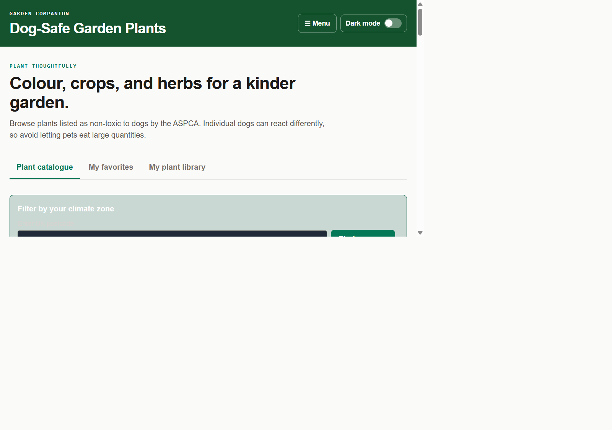
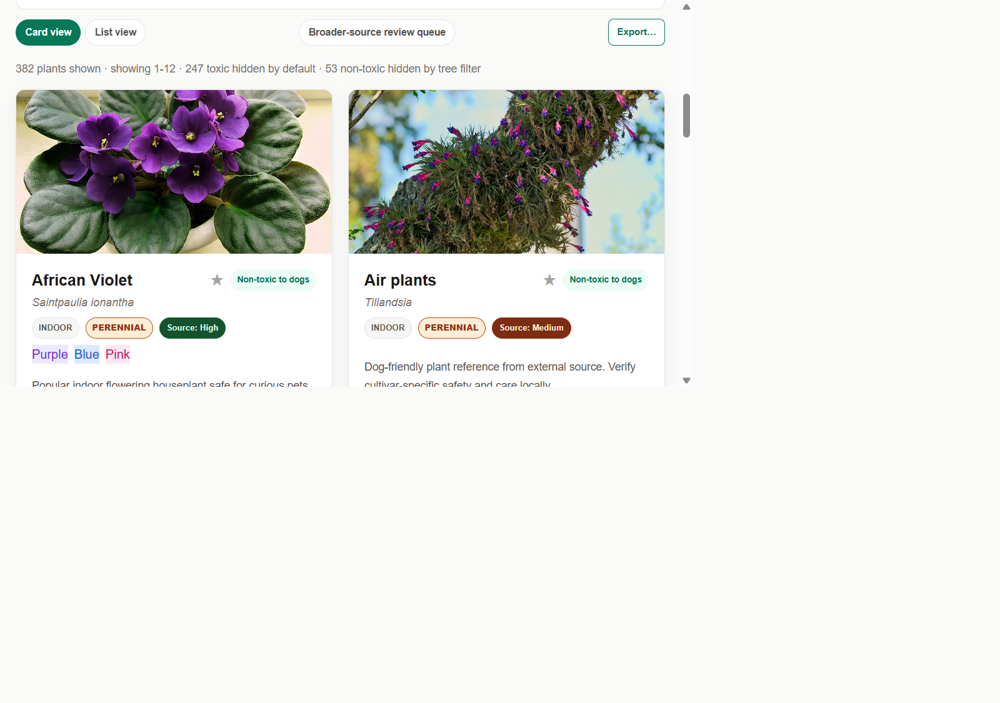

# 🐾 Dog Safe Plant Index

A curated, evidence-first catalogue of garden and houseplants that are safe for dogs — with a
review queue for uncertain candidates, a personal favourites/plant library, care reminders, and
an AI garden planner.



## Features

- **Evidence-first safety labelling** — every plant is tagged `Non-toxic`, `May be Toxic`, or
  `Toxic`, sourced from ASPCA, PDSA, Blue Cross, Pet Poison Helpline, VCA, and RHS references.
  Toxic and uncertain entries are hidden by default and never silently promoted.
- **Rich filtering** — search by name, safety status, bloom time, lifecycle, placement
  (indoor/outdoor), colour, and climate zone.
- **My favourites & plant library** — save plants you like and track ones you actually own, so you
  can build a personal planter library instead of just browsing the catalogue.
- **Care tasks & reminders** — lightweight care-task tracking backed by SQLite, so you don't need
  an external app to remember watering/feeding schedules.
- **Broader-source review queue** — a staging area for candidate plants gathered from wider
  horticultural sources, kept separate from the live catalogue until reviewed and approved.
- **AI garden planner** — generate a garden layout suggestion from your climate zone and
  preferences.
- **Image tooling** — an admin image manager plus bulk "find correct photo" tooling backed by
  iNaturalist/Wikimedia/Openverse sources.



## Tech stack

Flask · vanilla JS + Tailwind (CDN) · JSON "database" for the catalogue + SQLite for user data ·
Pillow for image processing · Playwright/BeautifulSoup for harvesting reference data.

## Quick start

```powershell
pip install -r requirements.txt
flask --app app run --debug
```

Open `http://127.0.0.1:5000/plants`.

## Key routes

| Route | Purpose |
|---|---|
| `/plants` | Main catalogue UI (light/dark mode) |
| `/api/dog-safe-plants*` | Catalogue CRUD/search |
| `/api/plant-review-queue*` | Broader-source review queue |
| `/api/plant-favorites*`, `/api/user-plants*` | Favourites & personal plant library |
| `/api/care-tasks*` | Care reminders |
| `/api/climate/*`, `/api/plants-by-climate` | Climate-zone lookups and filtering |
| `/api/plant-toxicity-evidence`, `/api/plant-synonyms` | Safety evidence & alias data |
| `/admin/images` | Image management UI |
| `/ai-garden-planner`, `/api/generate-garden-plan` | AI garden planner |
| `/docs` | In-app documentation |

## Important paths

- `database/dog_safe_plants.json` – live, approved catalogue
- `database/plant_review_queue.json` – staged review candidates (not yet approved)
- `database/plant_library.json` – shared favourite/care metadata seed
- `plant_user_data.db` – runtime SQLite user data (gitignored, created on first run)
- `plant_image_cache/` – optional local image cache (gitignored)

## Data-gathering scripts

```powershell
python scrape_dog_safe_plants.py
python harvest_plant_horticulture.py
python harvest_plant_synonyms.py
python tools/harvest_plant_profiles.py --limit 80
```

`harvest_plant_horticulture.py` is an interactive, resumable multi-source harvester — see
`run_horticulture_harvest.ps1` for a scripted batch-mode entry point.

## Deploying a live preview (Render)

This repo includes a [`render.yaml`](render.yaml) and `Procfile` so it deploys to
[Render](https://render.com)'s free tier with almost no setup:

1. Push this repo to GitHub (already done if you're reading this on GitHub).
2. On Render, choose **New → Blueprint** and point it at this repository — it will pick up
   `render.yaml` automatically and run `gunicorn app:app`.
3. Alternatively, choose **New → Web Service**, set the build command to
   `pip install -r requirements.txt` and the start command to `gunicorn app:app --bind 0.0.0.0:$PORT`.

The free tier spins down after inactivity, so the first request after a while may take ~30s to wake up.
Note: harvesting/scraping scripts (Playwright-based) are meant to be run locally/offline to populate
`database/*.json` — they aren't invoked by the deployed web service itself.

## Safety disclaimer

Safety information is gathered from trusted veterinary and horticultural sources for general
guidance only. Individual animals can react differently to any plant — always supervise pets
around new plants and consult a vet if you suspect ingestion of anything harmful.

---

Developed by [Riptide](https://github.com/28Riptide12) · © 2025
